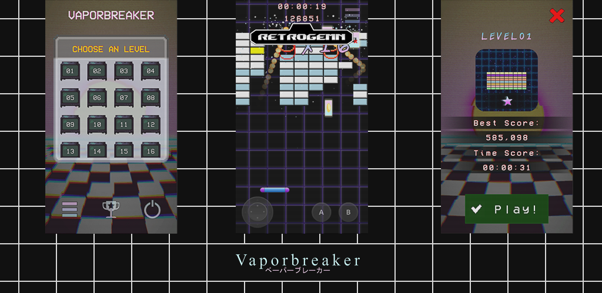
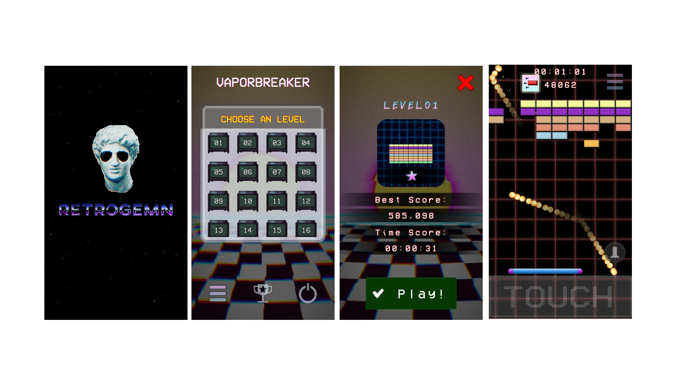

# V A P O R B R E A K E R - Mobile

## Screenshots

## About

Mobile (Android) version of my game [Vaporbreaker](https://github.com/williamdsw/vaporbreaker). 
Personally I think it's fits better the layout and design instead of the desktop version.

## Built with

* Unity
* C#
* Adobe Photoshop CS6
* GIMP
* Audacity

## Running the project locally

* Download `.zip` file or `git clone` this repo.
* Make sure that you have version `2020.1.15f1` of Unity or more recent one.
* Open `Unity Hub` and import the project (`Target Plataform = Android`).
* Open the `Logo Screen` scene, and hit the play button.

## Where to play

* [App in Google Store](https://play.google.com/store/apps/details?id=com.retrogemn.vaporbreaker)

## Credits

Some thanks for all those asset makers and/or artists!

### Fonts

* ["VCR OCD Mono" by Riciery Leal](https://www.dafont.com/pt/vcr-osd-mono.font)
* ["Aji Hand" by Ajith Rajan](https://www.dafont.com/pt/aji-hand.font)

### Sprites | Images

* "Background Gradient" by William Santos
* "Select Levels BG" by William Santos 
* "Paddles" by William Santos 
* "Power Ups Placeholders" by William Santos 
* "Power Ups Icons" by William Santos 
* "Retrogemn Icon" by William Santos 
* "Retrogemn Logo" by William Santos 
* "Vaporbreaker Logo" by William Santos 
* "Vaporbreaker Icon" by William Santos 
* "Line" by William Santos 
* Grid Backgrounds by William Santos
* ["Blocks Breaking Block Pack HD" by John B. Marine](https://opengameart.org/content/block-breaking-block-pack-hd)
* ["Arkanoid Assets" by pudman](https://opengameart.org/content/arkanoid-assets)
* ["Side Blaster GFX (M484 Games)" by Master484](https://opengameart.org/content/side-blaster-gfx-m484-games)
* ["Explosion Set 1 (M484 Games)" by Master484](https://opengameart.org/content/explosion-set-1-m484-games)
* ["Basic 16px GUI Pack" by tavoarts](https://tavoarts.itch.io/basic-pixel-gui-pack)
* ["Animated display static" by Cameron 'cron' Fraser](https://opengameart.org/content/animated-display-static)
* ["Onscreen controls (8 styles)" by Kenney.nl](https://opengameart.org/content/onscreen-controls-8-styles)
* ["UI pack: Space extension" by Kenney.nl](https://opengameart.org/content/ui-pack-space-extension)
* ["Grid HUD" by Ivan Voirol](https://opengameart.org/content/grid-hud)
* ["[LPC but not really] Bean Bag and Really Old TV" by Spring](https://opengameart.org/content/lpc-but-not-really-bean-bag-and-really-old-tv)

### Audio

#### Sound Effects (SE)

* ["Hitting in a Face" by florianreichelt](https://freesound.org/people/florianreichelt/sounds/460509/)
* ["Blip" by n_audioman](https://freesound.org/people/n_audioman/sounds/275897/)
* ["8 Bit Slam" by josepharaoh99](https://freesound.org/people/josepharaoh99/sounds/361636/)
* ["50 CC0 retro / synth SFX" by rubberduck](https://opengameart.org/content/50-cc0-retro-synth-sfx)
* ["16 button clicks" by Independent.nu](https://opengameart.org/content/16-button-clicks)
* ["Level up, power up, Coin get (13 Sounds)" by wobbleboxx.com](https://opengameart.org/content/level-up-power-up-coin-get-13-sounds)
* ["Pew Laser fire Sound" by sketcherskt](https://opengameart.org/content/pew-laser-fire-sound)
* ["Wall Impact" by spookymodem](https://opengameart.org/content/wall-impact)

#### Music Effects (ME)

* ["Fire Burning Loop" by midimagician](https://freesound.org/people/midimagician/sounds/249418/)
* ["Mission Success" by StormBat](https://freesound.org/people/StormBat/sounds/406371)

#### Background Music (BMG)

* ["120 bpm lofi synthwave loop" by waveplay_old](https://freesound.org/people/waveplay_old/sounds/424610/)
* ["Synth Wave" by Alex McCulloch](https://opengameart.org/content/synth-wave)
* ["Aerobics Synth Wave" by Alex McCulloch](https://opengameart.org/content/aerobics-synth-wave)
* ["And Then We Left" by Kim Lightyear](https://opengameart.org/content/and-then-we-left)
* ["Destiny (Wave G)" by Kim Lightyear](https://opengameart.org/content/destiny-wave-g)
* ["Saw You In My Dreams" by Kim Lightyear](https://opengameart.org/content/saw-you-in-my-dreams)
* ["Neon Transit" by Alexandr Zhelanov](https://opengameart.org/content/neon-transit)
* ["Ocean Wave Crashing the GUI" by Kris Occhipint](https://opengameart.org/content/ocean-wave-crashing-the-gui)